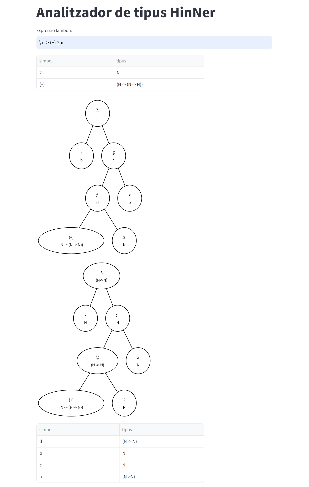

# Analitzador de Tipus HinNer

Aquest projecte consisteix en la implementació d'un analitzador de tipus anomenat *HinNer*, desenvolupat com a part de la pràctica de GEI-LP (edició 2023-2024 Q2). L'objectiu principal és crear un sistema d'inferència de tipus utilitzant un llenguatge similar a Haskell, seguint l'algorisme de Hindley-Milner.

## Funcionalitats

### Gramàtica
S'ha definit una gramàtica que reconeix diverses expressions simples del tipus Haskell, com ara:
- **Nombres naturals**: `2`
- **Variables**: `x`
- **Operadors en notació prefixa**: `(+) 2`
- **Aplicació**: `(\x -> (+) 2 x) 4`
- **Abstracció**: `\x -> (+) 2 x`

Aquesta gramàtica permet reconèixer i estructurar correctament les expressions per al seu posterior processament.

### Visitador
Conté un visitador que converteix l'AST (Abstract Syntax Tree) en un arbre semàntic. Aquest arbre semàntic representa l'estructura i el significat de les expressions analitzades. Per a la visualització gràfica de l'arbre semàntic, s'ha utilitzat el mètode `graphviz_chart` de la llibreria Streamlit.

### Gestió de Tipus
El sistema s'ha ampliat per reconèixer definicions de tipus i incloure-les en una taula de símbols. Això permet gestionar correctament els tipus associats a les expressions. Exemples de definicions de tipus inclouen:
- `2 :: N` (el número `2` és de tipus `N`)
- ` (+) :: N -> N -> N` (l'operador `+` és una funció que pren dos arguments de tipus `N` i retorna un valor de tipus `N`)

### Annotació dels AST
S'han modificat els arbres semàntics per permetre l'assignació d'un tipus a cada node de l'arbre. També s'ha implementat una funció que anota cada node amb el seu tipus corresponent, assignant l'element de la taula de símbols que li pertoqui o una nova variable de tipus.

### Inferència de Tipus
Hi han implementacions de funcions d'inferència de tipus per a diferents construccions. Això inclou la visualització en una taula dels tipus de totes les variables de tipus, proporcionant una visió clara de la inferència de tipus realitzada pel sistema.

- **Aplicació**:

- **Abstracció**: Afegit el processament de l'abstracció per a inferir correctament els tipus en expressions més complexes.

## Referències

- [ANTLR en Python](https://gebakx.github.io/Python3/compiladors.html#1)
- [Llibreria Streamlit](https://streamlit.io)
- [Tipus algebraics en Python](https://gebakx.github.io/Python3/tipusAlgebraics.html)
- [Graphviz DOT Language](https://graphviz.org/doc/info/lang.html)
